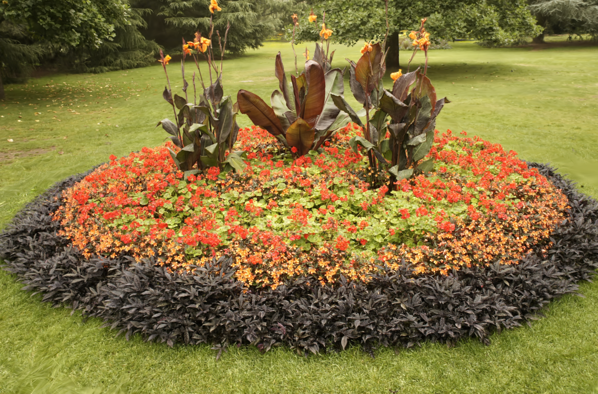

<h1 align="center"><strong>Pixel-GS</strong></h1>
<h2 align="center">Density Control with Pixel-aware Gradient for 3D Gaussian Splatting</h2>

<p align="center">
  <a href="">Zheng Zhang</a><sup>1</sup> ·
  <a href="https://wbhu.github.io/">Wenbo Hu</a><sup>2+</sup> ·
  <a href="https://yxlao.github.io/">Yixing Lao</a><sup>1</sup> ·
  <a href="https://tonghe90.github.io/">Tong He</a><sup>3</sup> ·
  <a href="https://hszhao.github.io/">Hengshuang Zhao</a><sup>1+</sup>
</p>

<p align="center"><sup>1</sup>The University of Hong Kong · <sup>2</sup>Tencent AI Lab · <sup>3</sup>Shanghai AI Lab</p>

<p align="center"><sup>+</sup>corresponding authors</p>

<h3 align="center"><a href="https://arxiv.org/pdf/2403.15530.pdf">Paper</a> | <a href="https://arxiv.org/abs/2403.15530">arXiv</a> | <a href="https://pixelgs.github.io/">Project Page</a></h3>

<p align="center">
  
  
</p>
<p align="center">
<strong>3DGS* （left）</strong> tends to exhibit blurring and needle-like artifacts in areas with insufficient point cloud initialization,
while <strong>Pixel-GS (right)</strong> by considering the conditions for point cloud growth from the pixel perspective effectively models these areas. 
<strong>*</strong> indicates retraining for better performance. 
</p>


## Installation

```
conda create -n pixelgs python=3.9 -y

conda install pytorch==2.0.1 torchvision==0.15.2 torchaudio==2.0.2 pytorch-cuda=11.8 -c pytorch -c nvidia

pip install -r requirements.txt

cd submodules
pip install ./diff-gaussian-rasterization
pip install ./simple-knn
```

## Dataset

### Mip-NeRF 360 Dataset

Please download the Mip-NeRF 360 dataset processed by colmap from [Mip-NeRF 360](https://jonbarron.info/mipnerf360/), and after unzipping "Dataset Pt. 1" and "Dataset Pt. 2", combine the scenes. Finally, the current directory should contain the following folders:

```
Pixel-GS
|---360_v2
    |---bicycle
    |   |---images
    |   |   |---<image 0>
    |   |   |---<image 1>
    |   |   |---...
    |   |---images_2
    |   |---images_4
    |   |---images_8
    |   |---sparse
    |       |---0
    |           |---cameras.bin
    |           |---images.bin
    |           |---points3D.bin
    |---bonsai
    |---...
```

### Tanks and Temples Dataset

#### Option 1

The processed Tanks and Temples dataset is available for direct download via [OneDrive](https://connecthkuhk-my.sharepoint.com/:u:/g/personal/u3009782_connect_hku_hk/EehzMcKeoclAnVdgPyyBxNwB24ve5bk3ZSct38AUWPbprw?e=uWEc5a). Please agree the official license before download it.

#### Option 2 

Tanks and Temples is divided into three parts, comprising a total of 21 scenes: Intermediate ('Family', 'Francis', 'Horse', 'Lighthouse', 'M60', 'Panther', 'Playground', 'Train'), Advanced ('Auditorium', 'Ballroom', 'Courtroom', 'Museum', 'Palace', 'Temple'), and Training Data ('Barn', 'Caterpillar', 'Church', 'Courthouse', 'Ignatius', 'Meetingroom', 'Truck').

Please download the "image set" of all scenes from the Tanks and Temples dataset from [Tanks and Temples](https://www.tanksandtemples.org/download/). After unzipping, rename the image folder directories of all scenes to "input". The organized folder structure is as follows:

```
Pixel-GS
|---tanks_and_temples
    |---Auditorium
    |   |---input
    |   |   |---<image 0>
    |   |   |---<image 1>
    |   |   |---...
    |---Ballroom
    |---...
```

After configuring libraries such as colmap according to the method in the original [3DGS code](https://github.com/graphdeco-inria/gaussian-splatting?tab=readme-ov-file#processing-your-own-scenes), use the following command to generate camera poses for all scenes in Tanks and Temples:

```
python ./prepose.py
```

Finally, the current directory should contain the following folders:

```
Pixel-GS
|---tanks_and_temples
    |---Auditorium
    |   |---images
    |   |   |---<image 0>
    |   |   |---<image 1>
    |   |   |---...
    |   |---images_2
    |   |---images_4
    |   |---images_8
    |   |---sparse
    |       |---0
    |           |---cameras.bin
    |           |---images.bin
    |           |---points3D.bin
    |---Ballroom
    |---...
```

Then, you need to rename the folder 'images_2' to 'images', since the resolution we are working with is close to 980x545.
You can also avoid renaming by simply changing `factors = [1] * len(scenes)` to `factors = [2] * len(scenes)` in `./script/tanks_and_temples.py`. This modification will instruct the code to reshape the images upon loading during training.

### Your Own Dataset

Our method requires the same data format as 3DGS. For your own data, you can use the processing method found in the ["Processing your own Scenes"](https://github.com/graphdeco-inria/gaussian-splatting?tab=readme-ov-file#processing-your-own-scenes) section of the original 3DGS code.

## Training and Evaluation

We have written two scripts that can run the training and testing for all scenes of the Mip-NeRF 360 dataset and the Tanks and Temples dataset with a single command. The launch instructions are as follows:

```
# Mip-NeRF 360
python ./script/mipnerf360.py
# Tanks and Temples
python ./script/tanks_and_temples.py
```

For training and testing individual scenes, our commands are identical to those in the original 3DGS code. For details, please refer to [Running](https://github.com/graphdeco-inria/gaussian-splatting?tab=readme-ov-file#running) and [Evaluation](https://github.com/graphdeco-inria/gaussian-splatting?tab=readme-ov-file#evaluation).

## Viewer

Since the rendering process and point cloud storage format of our method are identical to those of the original 3DGS, our method can use the same viewer as the original 3DGS. For specific usage tutorials, please refer to [Interactive Viewers](https://github.com/graphdeco-inria/gaussian-splatting?tab=readme-ov-file#interactive-viewers).

## Acknowledgements

This project is built upon [3DGS](https://github.com/graphdeco-inria/gaussian-splatting). Please follow the license of 3DGS. We thank all the authors for their great work and repos. 
## Citation

If you find this project useful, please consider citing:

```bibtex
@article{zhang2024pixelgs,
  title     = {Pixel-GS: Density Control with Pixel-aware Gradient for 3D Gaussian Splatting},
  author    = {Zheng, Zhang and Wenbo, Hu and Yixing, Lao and Tong, He and Hengshuang, Zhao},
  journal   = {arXiv:2403.15530},
  year      = {2024},
}
```
